# Expenses

Private, self-hosted expense tracking for you or your household, with a web app, a native iOS client, and an ingest endpoint for logging spend the moment you pay.

[](https://github.com/janishahn/expenses/actions/workflows/ci.yml)
[](LICENSE)
[](https://www.python.org/)

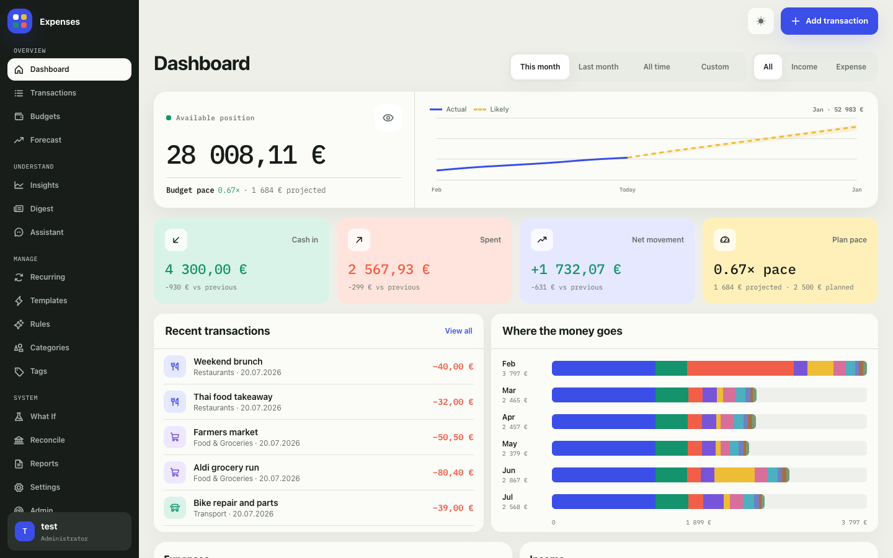

Expenses is a small self-hosted system for recording transactions, setting budgets, attaching receipts, reconciling bank statements, and keeping an eye on cash flow. It runs on hardware you control: a Raspberry Pi-class machine, a Mac mini, a small VPS, or any modest always-on host. Money is stored as integer cents in SQLite by default, and receipt files, logs, and generated secrets live in a local data directory that you own.

The native iOS app is shown near the end of this README, including [iPhone screenshots](#native-ios-app) from the same mock dataset.

> **Project status**: This is a personal, source-available project shared for others to self-host and learn from. It is maintained on a best-effort basis and is **not actively soliciting outside contributions**. Issues and pull requests may not be reviewed or merged. Feel free to fork it for your own noncommercial use under the [license](#license).

## Why Expenses

- Your financial data stays on hardware you control. SQLite by default, money stored as integer cents, and receipts, logs, and secrets kept in a local data directory you own.
- Runs on modest, always-on hardware down to a Raspberry Pi 4B, as well as a Mac mini, a small VPS, or anything similar.
- One process and one origin: FastAPI serves the React web app and the API together, so there is a single port to expose and put behind HTTPS.
- A web app for desktop and mobile browsers, plus a native SwiftUI iOS client that points at the same backend.
- Multi-user with per-user data isolation, so a household can share one instance while keeping separate data.
- Log spend at the moment you pay through a token-authenticated ingest endpoint, for example an Apple Shortcuts automation that fires on an Apple Wallet card tap.
- Optional LLM assistance for Uncategorized triage, rule mining, and a read-only spending assistant chat through an OpenAI-compatible endpoint, off by default.

## Features

*Screenshots show the web app's financial-switchboard interface in light mode with `uv run mock-db` sample data. Desktop uses a fully visible grouped sidebar; mobile keeps the current page's primary action in a compact top bar and opens every workspace from a labeled, edge-attached Menu.*

### Dashboard


The dashboard answers "where do I stand right now". Pick a period (this month, last month, all time, or a custom range) and see the available balance with actual history and a distinct projected continuation, followed by income, spending, net movement, and relevant budget health. Balance history begins with the first known snapshot instead of inventing an opening balance for earlier months. An overall monthly budget shows plan pace; category-only planning shows the aggregate category status plus the category that most needs attention. When no budgets exist, the planning lane disappears instead of prompting for an unused feature: desktop uses three equal metric columns, while mobile keeps income and spending side by side with net movement across the full second row. Hovering the desktop balance path reveals exact actual or likely values. Privacy mode conceals headline and analytical values while keeping budget health and recent transaction amounts readable. Mobile omits that history chart and the transaction-type selector. Recent transactions use the available desktop panel height without clipping a partial row or creating a nested scroller; mobile keeps the four latest rows. An accessible six-month category-band view shows how the composition of spending changed over time. Category donut legends use aligned responsive columns so labels and amounts remain easy to scan without nested scrolling, while segment tooltips show only the hovered percentage.

### Transactions

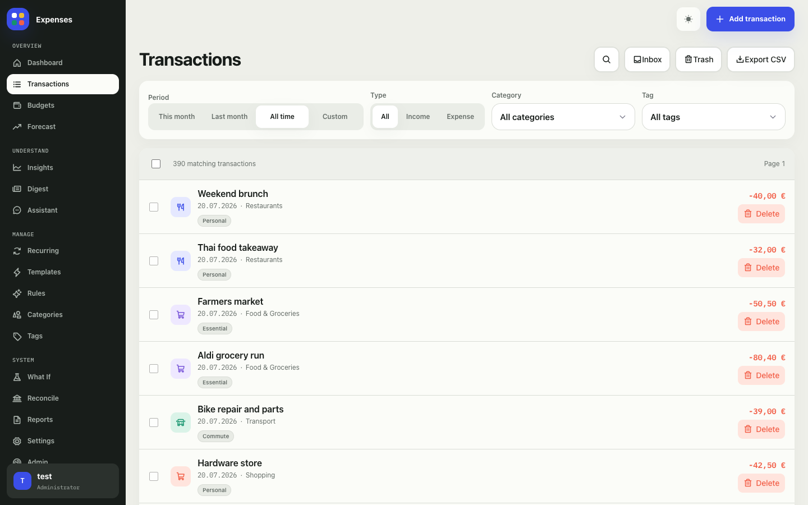

Transactions is the full working ledger and the page you will spend the most time in. Inbox, Trash, Export CSV, and the search reveal are explicit, high-contrast page actions kept separate from filtering. Search grows from its header trigger into an anchored popover without shifting the filter toolbar and uses typo-tolerant matching across titles and descriptions while preserving chronological order. Period, type, category, and tag remain explicit filters rather than search syntax. On desktop those filters stay visible in one URL-backed toolbar; on mobile they open in a focused bottom sheet and active filters remain removable from the page. Transaction checkboxes are always available, and the stable register header changes in place to expose a segmented bulk scope and bulk editing after you select a row instead of requiring a separate selection mode. Every entry supports tags, a category, receipt attachments, and an optional location, and a trash with soft delete keeps a mistaken delete recoverable. You can export the current view to CSV at any time, or download a self-describing portable archive from Settings when you need a fuller machine-readable export for migrations and agents.

### Budgets

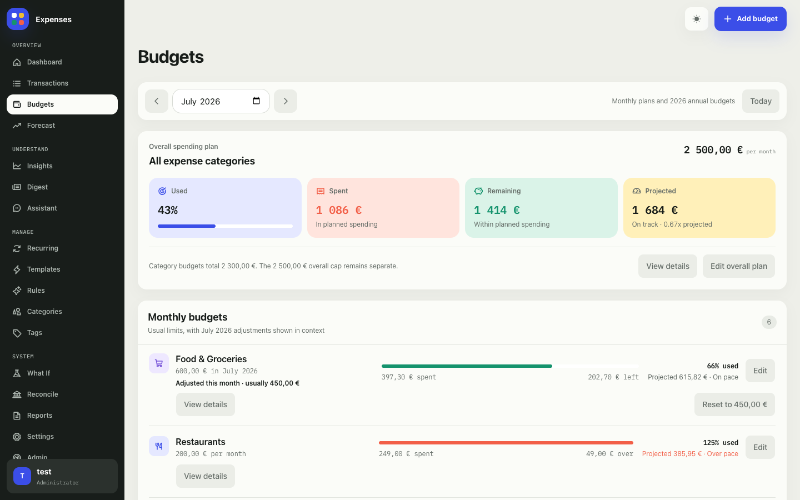

Budgets is one period-based planning workspace. Use the month arrows or picker to inspect another period, and Today to return to the current month. Add budget creates a repeating monthly category or overall limit by default; when editing a monthly limit, choose whether the change applies only to the selected month or from that month onward. One-month adjustments stay visible beside the usual amount and can be reset in place. View details opens the burn-down view and can compare the previous month. Annual budgets are created and edited in their own section on the same page instead of a separate mode. The summary keeps allocation, spent, remaining, and projected pace distinct, while an optional overall cap is reported separately and is never added to category limits.

### Insights

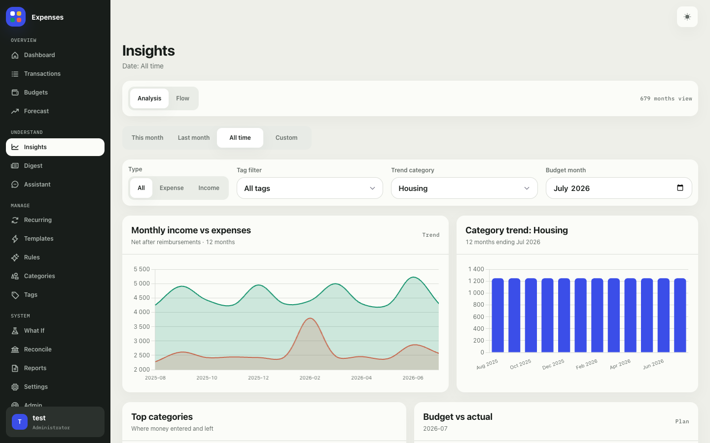

Insights is the visual analysis board. It charts income against expenses over the last twelve months, spending composition, the trend for any selected category, top categories, and budget versus actual for a chosen month. A single selected month renders explicit income and expense points instead of an empty-looking axis. A separate Flow tab draws a Sankey diagram of how money moves from income into each category, with category-tiled drill-downs for inspecting the shape of your spending.

### Recurring income and expenses

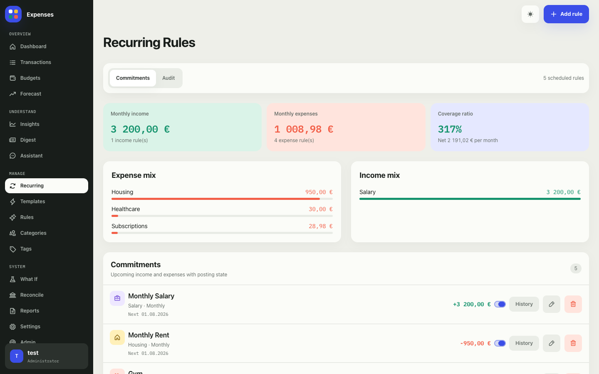

Recurring rules model the fixed parts of your finances: salary, rent, subscriptions, and anything else that repeats on a schedule. Add rule opens a focused creation modal, and each row's edit action opens the same workflow with that rule loaded. Each rule can auto-post its transaction when it comes due, and an audit view records what was posted. The summary cards frame recurring income against committed recurring costs as a coverage ratio, so you can see how much of each month is already accounted for before any discretionary spending.

Templates, categorization rules, categories, and tags use the same focused editing model: their page-level Add action opens a modal, and compact row actions open updates without keeping a form permanently beside the library. Templates can be reordered directly by their drag handles, with keyboard reordering available from the focused handle. Tags keep creation and merging as two separate modal workflows.

### Automatic categorization

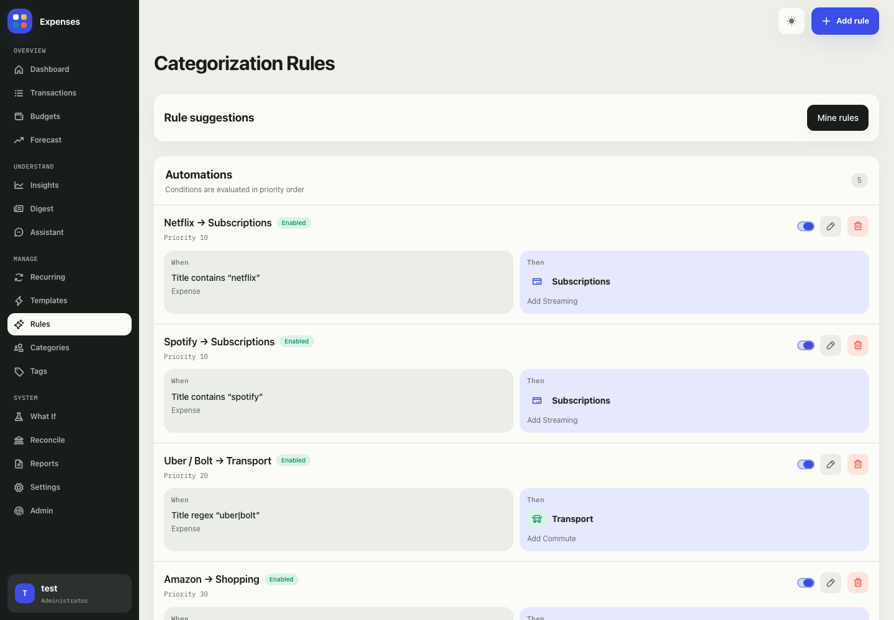

Categorization rules keep the ledger tidy without manual sorting. Add rule opens the shared modal editor; each automation row keeps its enable switch first, followed by compact edit and delete actions. A rule matches transactions by title text or regex, amount range, and type, then assigns a category and optional tags, with priorities deciding which rule wins when several match. New transactions are categorized as they arrive, and existing ones can be reprocessed. With optional LLM assistance enabled, "Mine rules" suggests rules from your existing transaction history.

### Spending assistant

When optional LLM assistance is enabled, the Assistant page is a read-only chat for asking about your spending in plain language, such as "what drove my spending last month" or "compare this month to last". It streams the reply as it is written and groups the lookups it runs into a compact, expandable activity line — spending overviews, period comparisons, category and tag breakdowns, transaction search and detail, and budget progress. The assistant can only read your data; it never creates, edits, or reclassifies transactions.

### And more

Beyond the pages above, Expenses includes Forecast and What-If scenarios for projecting cash flow forward, a Digest summary of recent activity, and exportable PDF reports. Reconcile imports a bank statement CSV and matches it against your recorded transactions to surface anything missing or duplicated; it is built as a general bank import and reconciliation flow, with Commerzbank CSV the only supported format for now. The native iOS app covers the same core flows, including setup and login, dashboard, transactions, budgets, insights, planning, reports, reconciliation, receipts, and the spending assistant.

Forecast starts from today's balance, applies the expected remainder of the current month, and then projects exact recurring postings alongside robust estimates for variable spending and income. Manually recorded recurring history—including USD and yearly rules—is removed from the variable baseline so the same payment is not projected twice. It uses the median of up to 12 complete recent months for noisy cash flow and, once 24 complete months are available, learns shrunken month-of-year patterns such as consistently higher December spending. Full forecasts show a deterministic 80% prediction range derived from historical residuals and flag months whose balance is expected to dip below zero before month-end. These calculations are local, bounded to 36 months of history, and designed for Raspberry Pi-class hardware; they are estimates, not guarantees.

## Interfaces

- **Web app**: React SPA served by FastAPI, optimized for mobile and desktop browsers.
- **Native iOS app**: SwiftUI client under `ios/ExpensesApp`, pointed at your self-hosted backend.
- **HTTP API**: same-origin `/api/*` endpoints for the web app, mobile bearer-session endpoints for iOS, CSV import/export, portable ZIP export, PDF reports, and optional ingest automation.

The preferred exposure model is private: localhost, LAN, VPN, Tailnet, or a trusted reverse proxy with HTTPS. This app stores personal financial data, so do not expose it casually to the public internet. The recommended setup runs the host and all devices on one Tailscale tailnet; see [Serving & Access](#serving--access).

## Quick Start: Docker

Docker is the simplest self-hosted install. It builds the web UI, installs locked Python dependencies, runs migrations on startup, serves the app on port `8000`, and persists SQLite data, receipts, logs, and generated secrets in a Docker volume.

```bash
git clone https://github.com/janishahn/expenses.git
cd expenses
docker compose up --build -d
```

To run a pre-built image instead of building locally, pull the published container:

```bash
docker pull ghcr.io/janishahn/expenses:latest
```

Open `http://localhost:8000`, or replace `localhost` with the host on your private network. On first launch, the app routes to `/setup` to create the bootstrap admin account.

Useful commands:

```bash
docker compose logs -f expenses
docker compose ps
docker compose down
```

The compose file reads common overrides from a repo-root `.env` file:

```env
EXPENSES_HTTP_PORT=8000
EXPENSES_ENV=Production
EXPENSES_TIMEZONE=Europe/Berlin
```

For access outside localhost or a private network, put the app behind HTTPS with a reverse proxy, VPN, or tunnel you trust. See [Serving & Access](#serving--access) for the recommended tailnet setup and the optional public-domain path.

## Bare Metal

Use bare metal when you want direct control over the Python process, a systemd service, or a host-level reverse proxy.

Prerequisites:

- Python 3.12+
- Node.js 20+ and npm
- SQLite
- [uv](https://docs.astral.sh/uv/)

Setup:

```bash
git clone https://github.com/janishahn/expenses.git
cd expenses
uv sync --frozen --no-dev
npm ci --prefix ui
npm run --prefix ui build
uv run --no-dev migrations
uv run --no-dev uvicorn expenses.app:app --host 0.0.0.0 --port 8000 --proxy-headers --forwarded-allow-ips 127.0.0.1
```

The app serves the React SPA and the `/api/*` endpoints from one process on one origin, so a single port is all you expose. `--proxy-headers --forwarded-allow-ips 127.0.0.1` tells the app to trust `X-Forwarded-Proto`/`X-Forwarded-For` only from a local reverse proxy or tunnel (see [Serving & Access](#serving--access)). This is what makes secure cookies and CSRF work when TLS is terminated in front of the app.

For a long-running service, use a dedicated app directory and state directory. The repo includes `start.sh` as a simple service entrypoint; it runs the built FastAPI app on `0.0.0.0:8000`, honors `EXPENSES_HTTP_PORT` for a host-specific port, trusts proxy headers from `127.0.0.1`, and defaults `EXPENSES_ENV` to `Production`.

Minimal systemd shape:

```ini
[Unit]
Description=Expenses
After=network.target

[Service]
Type=simple
User=expenses
Group=expenses
WorkingDirectory=/srv/expenses
Environment=EXPENSES_ENV=Production
Environment=EXPENSES_DATA_DIR=/var/lib/expenses
Environment=EXPENSES_LOG_DIR=/var/log/expenses
# Optional: override the listen port if 8000 is already taken on this host.
# Environment=EXPENSES_HTTP_PORT=8001
ExecStart=/srv/expenses/start.sh
Restart=always

[Install]
WantedBy=multi-user.target
```

PDF export uses WeasyPrint and may need OS-level cairo/pango libraries. On Apple Silicon macOS, Homebrew libraries may require `DYLD_FALLBACK_LIBRARY_PATH=/opt/homebrew/lib` if WeasyPrint cannot load `libgobject-2.0-0`.

## Serving & Access

The web app and the API are one process on one origin: the FastAPI app serves the built React SPA and every `/api/*` endpoint from the same host and port. There is no separate frontend server and no per-endpoint port split. Whatever front door you put in front of that origin exposes the full API surface (web session, mobile bearer sessions, and ingest), so access control belongs at the transport you choose plus the app's own authentication.

The app speaks plain HTTP on its listen port and expects TLS to be terminated in front of it. Keep the listen port bound locally or to your private network, and reach it through one of the two paths below. Both forward `X-Forwarded-Proto: https` so the app marks session cookies `Secure` and validates CSRF correctly.

### Recommended: one tailnet (Tailscale)

The recommended setup puts the host and all your devices on a single [Tailscale](https://tailscale.com/) tailnet and serves HTTPS over the tailnet with `tailscale serve`. Nothing is exposed to the public internet, and Tailscale provisions a real Let's Encrypt certificate for the host's MagicDNS name, so you do not manage certificates yourself.

On the host running the app (replace `8000` if you set `EXPENSES_HTTP_PORT`):

```bash
tailscale serve --bg 8000
tailscale serve status
```

This publishes the app at `https://<host>.<tailnet>.ts.net` to tailnet members only. Use that HTTPS name everywhere:

- **Web app**: open `https://<host>.<tailnet>.ts.net` in any browser on the tailnet.
- **iOS app**: set the backend URL to the same `https://<host>.<tailnet>.ts.net`. Because it is a valid HTTPS certificate, no iOS App Transport Security exception is needed.
- **Automatic ingest**: point the Shortcuts automation at `https://<host>.<tailnet>.ts.net/api/ingest` (see [Automatic Ingest](#automatic-ingest)).

With this setup every device path — the web UI, the iOS app, and the Wallet ingest automation — uses the same tailnet origin and needs no public DNS, no port forwarding, and no certificate management. The tradeoff is that a device must be on the tailnet to reach the app; Tailscale normally runs in the background, so this is seamless in practice.

### Optional: public web access on your own domain

If you want to reach the web app from a browser that is not on your tailnet, or from a vanity domain you own, put an HTTPS reverse proxy or tunnel in front of the same local port. Keep the iOS app and the ingest automation on the tailnet path above; only browser traffic needs the public domain.

A reverse proxy such as nginx, Caddy, or Traefik terminating TLS, or a tunnel such as Cloudflare Tunnel, both work. The essential requirements are: terminate TLS in front of the app, proxy to the app's local port, and forward the `Host`, `X-Forwarded-For`, and `X-Forwarded-Proto` headers. Example nginx location block proxying to a host-local app on port `8000`:

```nginx
server {
    server_name expenses.example.com;
    location / {
        proxy_pass http://127.0.0.1:8000;
        proxy_set_header Host $host;
        proxy_set_header X-Real-IP $remote_addr;
        proxy_set_header X-Forwarded-For $proxy_add_x_forwarded_for;
        proxy_set_header X-Forwarded-Proto $scheme;
        client_max_body_size 10M;
    }
}
```

Because the whole API lives behind that one origin, a public domain also exposes `/api/ingest` and `/api/mobile/*`, where the only boundary is app authentication. If you expose the web app publicly, consider one of:

- Put an SSO/identity gate (for example Cloudflare Access or an auth proxy) in front of the public door. Devices still reach the app over Tailscale, so this does not affect the iOS app or ingest.
- Restrict the public reverse-proxy host to the web app only and block `/api/ingest` and `/api/mobile/*` there, since browsers never need those endpoints. Devices continue to use those endpoints over the tailnet.

See `SECURITY.md` for the deployment threat model.

## Configuration

`src/expenses/core/config.py` is the central runtime configuration boundary. Safe operational defaults live in code; environment variables are for deployment-specific paths, secrets, host behavior, and optional integrations. Local development also loads a repo-root `.env` file through `python-dotenv`; real process environment variables take precedence.

Start from `.env.example` for common settings. Keep `.env` local and uncommitted.

### Common Settings

| Variable | Purpose | Default |
|---|---|---|
| `EXPENSES_ENV` | Environment label shown in Admin/startup logs. Values below are not magic except `test` for relaxed password-hash validation. | `Local` |
| `EXPENSES_DATA_DIR` | Root directory for SQLite data, imports, generated secrets, and default receipts. | `./data` |
| `EXPENSES_DATABASE_URL` | SQLAlchemy database URL. SQLite is the intended self-hosted path. | `sqlite:///<EXPENSES_DATA_DIR>/expenses.db` |
| `EXPENSES_TIMEZONE` | Timezone used by recurrence scheduling. | `Europe/Berlin` |
| `EXPENSES_AUTH_SETUP_TOKEN` | Optional bootstrap setup token. If set while no users exist, web and mobile setup must send it as `X-Setup-Token`. | unset |
| `EXPENSES_AUTH_SIGNUP_ENABLED` | Enables self-service account signup after bootstrap. Enabled by default; set to `false` to restrict the app to existing accounts (single-user/private installs). | `true` |
| `EXPENSES_CSRF_SECRET` | Optional explicit CSRF signing secret. Prefer leaving blank and letting the app persist one. | unset |
| `EXPENSES_CSRF_SECRET_FILE` | Optional file path for a persisted CSRF signing secret. | unset |
| `EXPENSES_RECEIPTS_DIR` | Directory for receipt attachment files. | `<EXPENSES_DATA_DIR>/receipts` |
| `EXPENSES_LOG_DIR` | Directory for structured JSON logs. Docker sets this to `/data/logs`. | sibling `logs/` next to data |
| `EXPENSES_LOG_LEVEL_STDOUT` | Log level for stdout/systemd/Docker logs. | `WARNING` (`INFO` in Docker) |
| `EXPENSES_FORWARDED_ALLOW_IPS` | Docker image setting passed to uvicorn's `--forwarded-allow-ips` when using proxy headers. Use the direct proxy IPs that connect to the app. | `127.0.0.1` |
| `EXPENSES_TRUSTED_PROXY_IPS` | Comma-separated direct client IPs whose `X-Forwarded-Proto` value the app may trust when deciding whether auth cookies should be `Secure`. | unset |

CSRF secret precedence:

1. Use `EXPENSES_CSRF_SECRET` if set.
2. Otherwise use `EXPENSES_CSRF_SECRET_FILE` if set. If the file is missing, the app creates it with mode `0600`.
3. Otherwise generate and reuse `<EXPENSES_DATA_DIR>/secrets/csrf_secret`.

Startup logs record only the source of the CSRF secret, never the secret value.

### Less-Common Settings

| Variable | Purpose | Default |
|---|---|---|
| `EXPENSES_AUTH_SESSION_COOKIE_NAME` | Web auth session cookie name. | `expenses_auth_session` |
| `EXPENSES_AUTH_SESSION_MAX_AGE_SECONDS` | Web session max age. | `2592000` |
| `EXPENSES_MOBILE_SESSION_MAX_AGE_SECONDS` | Native mobile bearer session max age. | `7776000` |
| `EXPENSES_AUTH_PASSWORD_HASH_ITERATIONS` | PBKDF2 iterations. Values below `100000` are rejected unless `EXPENSES_ENV=test`. | `600000` |
| `EXPENSES_AUTH_ADMIN_ELEVATION_TTL_SECONDS` | Admin password re-entry TTL. | `900` |
| `EXPENSES_AUTH_THROTTLE_MAX_FAILURES` | Failed login/admin-elevation attempts allowed per direct client, purpose, and username before throttling. Set `0` to disable. | `5` |
| `EXPENSES_AUTH_THROTTLE_WINDOW_SECONDS` | Rolling window for auth throttling. | `300` |
| `EXPENSES_AUTH_THROTTLE_LOCKOUT_SECONDS` | Lockout duration after the failure limit is reached. | `60` |
| `EXPENSES_AUTH_THROTTLE_MAX_KEYS` | Maximum in-memory throttle keys retained by one app process. | `4096` |
| `EXPENSES_RECEIPT_MAX_BYTES` | Max upload size per receipt attachment. | `10485760` |
| `EXPENSES_RECEIPT_THUMBNAIL_MAX_PIXELS` | Max source image pixels accepted when generating receipt thumbnails. | `20000000` |
| `EXPENSES_CSV_IMPORT_MAX_BYTES` | Max upload size for transaction CSV imports. | `5242880` |
| `EXPENSES_CSV_IMPORT_MAX_ROWS` | Max transaction CSV rows parsed per import. | `5000` |
| `EXPENSES_BANK_CSV_IMPORT_MAX_BYTES` | Max upload size for bank reconciliation CSV imports. | `5242880` |
| `EXPENSES_BANK_CSV_IMPORT_MAX_ROWS` | Max bank reconciliation CSV rows parsed per import. | `5000` |
| `EXPENSES_SQLITE_IMPORT_MAX_BYTES` | Max upload size for legacy SQLite imports. | `26214400` |
| `EXPENSES_SQLITE_IMPORT_DIR` | Directory for temporary legacy SQLite import previews. | `<EXPENSES_DATA_DIR>/imports` |
| `EXPENSES_RULE_REGEX_TIMEOUT_SECONDS` | Timeout for one rule-regex evaluation. | `0.05` |
| `EXPENSES_RULE_REGEX_MAX_LENGTH` | Maximum rule-regex pattern length. | `200` |
| `EXPENSES_REPORT_MAX_DAYS` | Max date range accepted for PDF report generation. | `366` |
| `EXPENSES_REPORT_MAX_TRANSACTIONS` | Max matching transactions accepted for one PDF report. | `5000` |
| `EXPENSES_LOG_LEVEL_FILE` | File log level. | `INFO` |
| `EXPENSES_LOG_MAX_BYTES` | Size of `app.jsonl` before rotation. | `10485760` |
| `EXPENSES_LOG_BACKUP_COUNT` | Rotated log files to retain. | `10` |
| `EXPENSES_LOG_CAPTURE_MAX_BYTES` | Request-body bytes captured on focused troubleshooting paths. | `65536` |
| `EXPENSES_FX_TIMEOUT_SECS` | Timeout for ECB FX lookups. | `5` |
| `EXPENSES_FX_MARKUP_BPS` | Optional basis-point reduction applied to live/cached ECB rates. | `0` |
| `EXPENSES_FX_FALLBACK_RATE` | Static USD-to-EUR read-path fallback if no live/recent cached quote exists. | `0.92` |

### Frontend Build Settings

These `VITE_*` values are read when the React app is built. Rebuild the UI or Docker image after changing them.

| Variable | Purpose | Default |
|---|---|---|
| `VITE_MAP_TILE_URL` | Leaflet tile URL template for transaction location maps. Leave unset for the default OpenStreetMap tiles, set a different provider's template to override, or set it to an empty value to render markers without external tile requests. | `https://tile.openstreetmap.org/{z}/{x}/{y}.png` |
| `VITE_MAP_TILE_ATTRIBUTION` | Attribution HTML shown by Leaflet over the map tiles. | OpenStreetMap attribution |

### Optional LLM Assistance

LLM features are disabled by default and are review-first when enabled. The configured endpoint must be OpenAI-compatible. While `EXPENSES_LLM_ENABLED` is off, the feature is cleanly absent rather than visible-but-broken: the web and iOS apps hide every AI surface (the Assistant nav entry and page, rule mining and suggestions, Uncategorized triage, and the admin Assistant-usage panel), and every existing `/api/ai/*` endpoint returns `503`. Clients learn the flag's state from `/api/auth/bootstrap-status` (web) and `/api/mobile/status` (iOS).

```env
EXPENSES_LLM_ENABLED=false
EXPENSES_LLM_BASE_URL=http://example-tailnet-host:8080/v1
EXPENSES_LLM_MODEL=qwen
EXPENSES_LLM_API_KEY=
EXPENSES_LLM_TEMPERATURE=
EXPENSES_LLM_MAX_OUTPUT_TOKENS=
```

`EXPENSES_LLM_BASE_URL` can point to a private Tailnet/MagicDNS endpoint or any hosted OpenAI-compatible API such as OpenRouter. Leave `EXPENSES_LLM_API_KEY` blank for unauthenticated private endpoints. The app sends feature-specific OpenAI/OpenRouter-compatible `reasoning.effort` values and output caps: transaction triage uses `low` with 2048 output tokens, while rule mining and spending chat use `medium` with 4096 output tokens. Reasoning tokens count toward the same output-token cap as the visible JSON response, so lowering `EXPENSES_LLM_MAX_OUTPUT_TOKENS` can truncate reasoning-model responses. Leave `EXPENSES_LLM_TEMPERATURE` and `EXPENSES_LLM_MAX_OUTPUT_TOKENS` blank to use the built-in per-feature defaults; when set, those values replace the defaults for every LLM feature. Structured responses are validated against the relevant runtime data before the app accepts them; invalid triage and rule-mining output is skipped and recorded in the LLM trace logs.

The read-only spending chat powers the web Assistant page and the native iOS app's Assistant screen, both exposed through `POST /api/ai/spending-chat/stream`. It requires normal app authentication and streams `application/x-ndjson` events such as `turn_started`, `tool_call_start`, `tool_call_end`, `progress_narration`, `text_chunk`, `text_commit`, `result`, `done`, and `error`. Its tools can read spending overviews, compare periods, break down spending, search and inspect transactions, and read budget progress; they cannot create, update, delete, or reclassify data. Each turn is recorded as one `spending_chat` row in the LLM trace log with status, duration, provider metadata, token counters, cached/reasoning-token counters when available, and provider-reported cost when available. Chat trace rows store output hashes and counts instead of the final assistant text or returned message history. Authenticated clients can read aggregate usage through `GET /api/ai/usage/summary?feature=spending_chat&period=week|month|all`. The web Admin page surfaces this summary as an Assistant usage panel — chat counts, token totals with cached/reasoning counters, provider-reported cost, average tokens per chat, and p95 latency — with a week/month/all-time switch.

## Data, Backups, And Logs

Back up the deployment data directory:

- Docker: the `expenses_data` volume mounted at `/data`.
- Bare metal: the directory configured through `EXPENSES_DATA_DIR`.

At minimum, include:

- `expenses.db` plus SQLite `-wal` and `-shm` files if the app is running.
- `receipts/` for uploaded receipt files.
- `secrets/csrf_secret` unless you store the CSRF secret elsewhere.

Structured JSON logs are written to `EXPENSES_LOG_DIR/app.jsonl` and rotate according to the log settings above. The Admin page also includes an application log viewer. Logs are useful for operations, but database files, receipts, generated secrets, and backups are the sensitive data that must be protected.

See `SECURITY.md` for the deployment threat model and vulnerability-reporting policy.

## Mock Data

`uv run mock-db` creates or recreates the local SQLite database with screenshot-ready sample data:

- About 400 semi-realistic transactions across 12 current months.
- Budgets, recurring rules, durable purchases, receipts, locations, tags, rules, reimbursement links, trash entries, and reconciliation examples.
- A local admin-capable demo user: `test` / `test`.

```bash
uv run mock-db
uv run mock-db --yes
```

The `test` / `test` account is only for mock data. Real installs bootstrap the first admin account through `/setup`.

## Development

Install dependencies and run the local development server:

```bash
uv sync --group dev
npm ci --prefix ui
uv run dev
```

Useful commands:

```bash
uv run fast-tests                   # ruff + backend tests + frontend lint + frontend build
uv run full-tests                   # release/shared-infrastructure Playwright matrix
uv run pytest                       # backend tests only
uv run ruff check --fix .
uv run ruff format .
uv run migrations
uv run mock-db --yes
uv run forecast-backtest --json       # rolling historical forecast accuracy and interval coverage
uv run export-openapi
uv run export-ios-fixtures
npm audit --prefix ui --audit-level=high
```

`uv run fast-tests` is the normal local and pull-request gate; pair it with the focused Playwright specs and affected layouts for feature work. Reserve `uv run full-tests` for release candidates, changes to shared browser/runtime infrastructure whose risk spans most routes, or an explicit request—not merely for a large diff or page redesign. The full command runs desktop Chromium, mobile WebKit, route accessibility/overflow checks, visual baselines, and critical Firefox, desktop WebKit, and mobile Chromium journeys. Every Playwright worker boots its own FastAPI server on a fresh temporary database, so browser tests scale with CPU cores and produce a single HTML report; total runtime depends on the host and installed browsers. Install the browser binaries once with `npm --prefix ui run test:e2e:install`.

`uv run forecast-backtest --json` performs a read-only rolling-origin check against the current user's complete transaction months. It reports the model's mean absolute error, the previous three-month expense-only baseline's error, and empirical coverage of the nominal 80% interval. Use `--user-id <id>` to evaluate another local user.

CI runs dependency audits and `uv run fast-tests` on pull requests and default-branch pushes. The complete browser suite is available through the manually dispatched **Full tests** workflow rather than running on every commit. See [`TESTING.md`](TESTING.md) for the testing policy, browser matrix, focused commands, and coverage ledger.

## Automatic Ingest

`POST /api/ingest` is a small, token-authenticated endpoint for creating an expense from an external automation, such as an Apple Shortcuts personal automation that fires when you tap a card in Apple Wallet. It is the recommended way to capture spend at the moment of payment without opening the app.

### Token

Each user mints a personal ingest token in **Settings → Ingest Token**. The token is shown once at creation; copy it then, and rotate or revoke it from the same screen. Requests authenticate with a bearer header:

```
Authorization: Bearer <ingest-token>
```

### Request

Send JSON to `<base-url>/api/ingest`, where `<base-url>` is your tailnet HTTPS origin (recommended, for example `https://<host>.<tailnet>.ts.net`) or your public domain. The endpoint only creates expenses.

| Field | Required | Notes |
|---|---|---|
| `amount_cents` | yes | Integer cents, `>= 0`. For a `9.90 €` charge, send `990`. |
| `title` | yes | 1–200 characters. |
| `date` | no | `YYYY-MM-DD`. Defaults to today in `EXPENSES_TIMEZONE`. |
| `category` | no | Category name. Exact match wins; a near-match (edit distance 1) resolves fuzzily; an unambiguous new name creates the category; otherwise the expense is left `Uncategorized`. |
| `latitude` / `longitude` | no | Decimal degrees. Both must be present and in range to be stored; a partial or out-of-range pair is ignored. |

A successful call returns `201` with the created transaction, including its resolved `category` and a `location_status` of `not_provided`, `stored`, or `ignored_partial`. Missing or invalid tokens return `401`; an unknown category returns `404`; an ambiguous category returns `409`.

```bash
curl -X POST https://<host>.<tailnet>.ts.net/api/ingest \
  -H "Authorization: Bearer <ingest-token>" \
  -H "Content-Type: application/json" \
  -d '{"amount_cents": 990, "title": "Bakery", "category": "Groceries"}'
```

### Recommended Apple Shortcuts automation (Wallet tap → ingest)

Create a **Personal Automation** in the Shortcuts app so a card tap posts the charge to your tailnet backend. Because it targets the `*.ts.net` HTTPS name, the only secret it carries is the ingest bearer token — no Cloudflare Access headers or other proxy credentials.

1. **Trigger** — *Personal Automation → Transaction*, scoped to the card(s) you want to capture (for example your VISA and girocard), and set it to **Run Immediately** so it fires without a confirmation prompt.
2. **Compute `amount_cents`** — the trigger provides the transaction **Amount**. Add a **Calculate** step `Amount × 100`, then **Round** the result to the nearest **Integer**. This converts euros to integer cents.
3. **(Optional) Capture location** — add **Get Current Location**, then read **Latitude** and **Longitude** from it. A short **Wait** (a few seconds) before reading location gives the GPS a moment to settle. Skip this block if you do not want location on ingested expenses.
4. **Post to the backend** — add **Get Contents of URL** pointed at `https://<host>.<tailnet>.ts.net/api/ingest` with:
   - **Method**: `POST`
   - **Headers**: `Authorization` = `Bearer <ingest-token>`
   - **Request Body**: `JSON` with `amount_cents` set to the rounded integer, `title` set to a label (the Wallet **Merchant** value if your trigger exposes it, otherwise a static name), and, if you captured them, `latitude` and `longitude`.
5. **(Optional) Confirm** — add **Show Notification** with **Contents of URL** so each run surfaces the backend's response.

The same flow works against a public domain if you serve one, but the tailnet origin is recommended: it needs only the bearer token and keeps ingest off the public internet.

## Native iOS App

The iOS client lives in `ios/ExpensesApp` and targets iOS 26+. It uses device-specific bearer sessions, stores the mobile session in Keychain, supports local device unlock with Face ID/Touch ID/passcode, and points at the configured self-hosted backend.

Open `ios/ExpensesApp/ExpensesApp.xcodeproj` in Xcode to build locally. Simulator/debug builds default to a local backend. For device use, set the backend URL to your tailnet HTTPS origin (the host's MagicDNS name, for example `https://<host>.<tailnet>.ts.net`). That name has a valid certificate, so device builds work over HTTPS without an App Transport Security exception; the only built-in ATS exception is for `localhost` during local development.

To build, install, and launch on a connected device from the command line (macOS with Xcode), run `uv run run-ios-device`. It auto-detects the only paired iPhone — or pass `--device <name-or-UDID>` when several are connected — builds the Debug configuration with the project's existing automatic code-signing, installs over the previous build, and launches it. Because it reuses your current signing certificate and provisioning profile, you do not need to re-trust the developer on the device between reinstalls. Pass `--no-launch` to install without launching, or `--configuration Release` for a release build.

Screenshots from the native iOS app are below. They use the same `uv run mock-db` sample data as the web app screenshots above.

<p>
  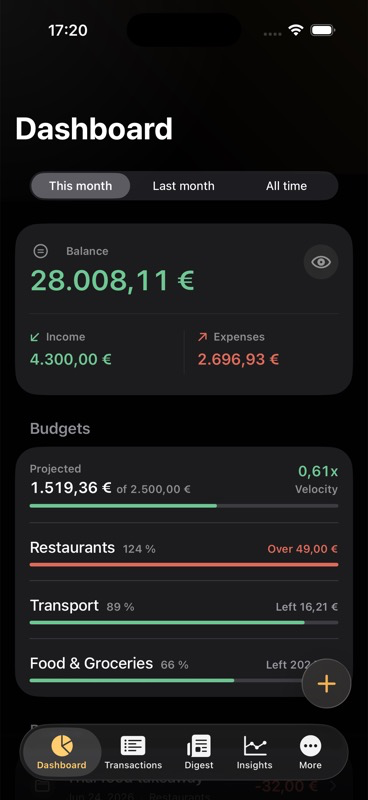
  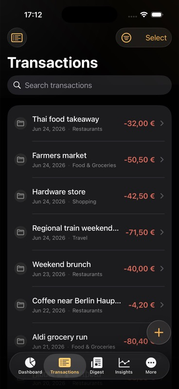
  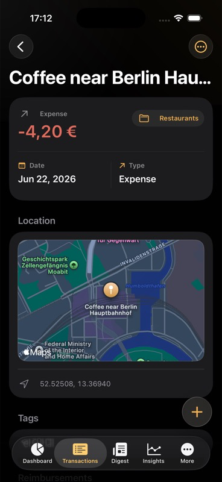
</p>

<p>
  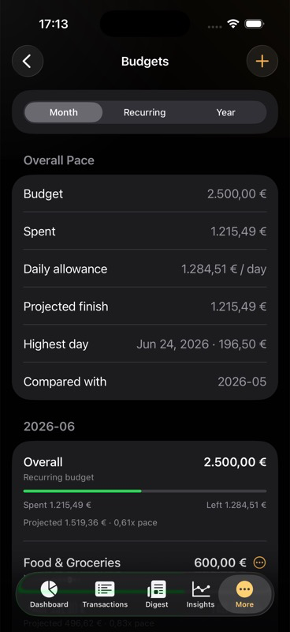
  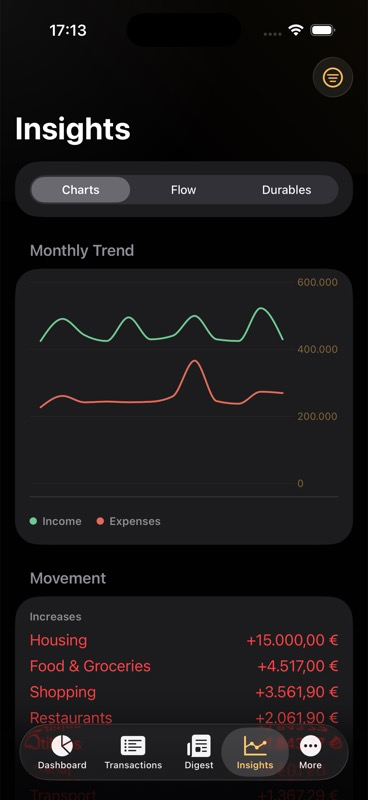
  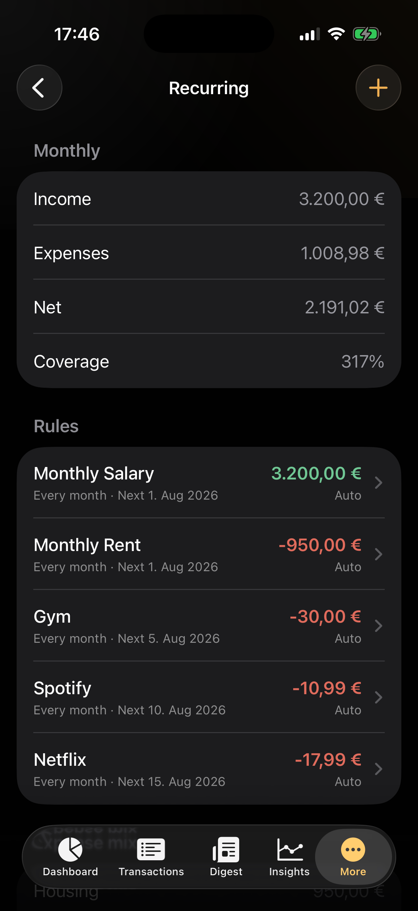
</p>

<p>
  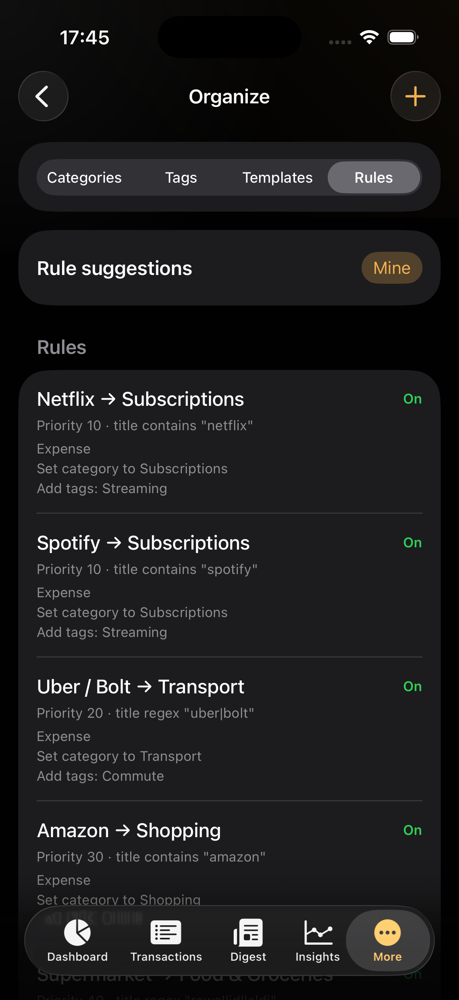
  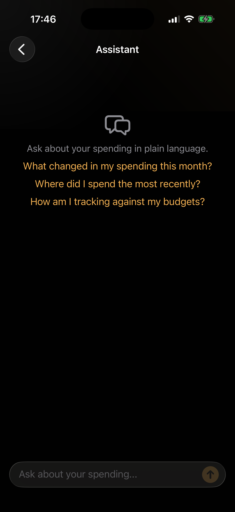
</p>

## License

This project is licensed under the PolyForm Noncommercial License 1.0.0. See `LICENSE` for the full license text.

You may use, copy, modify, and distribute this software for permitted noncommercial purposes under the license terms. Commercial use is not permitted. Because of that noncommercial restriction, this is source-available software, not OSI-approved open source.
