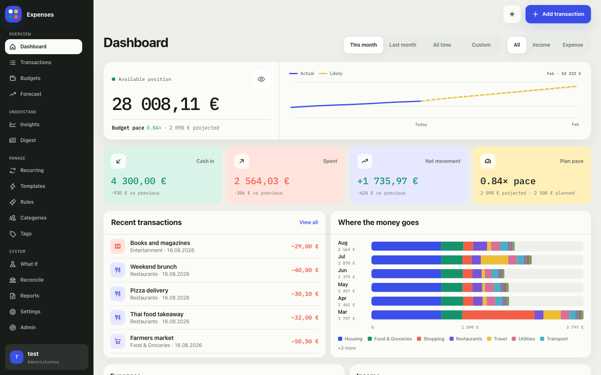
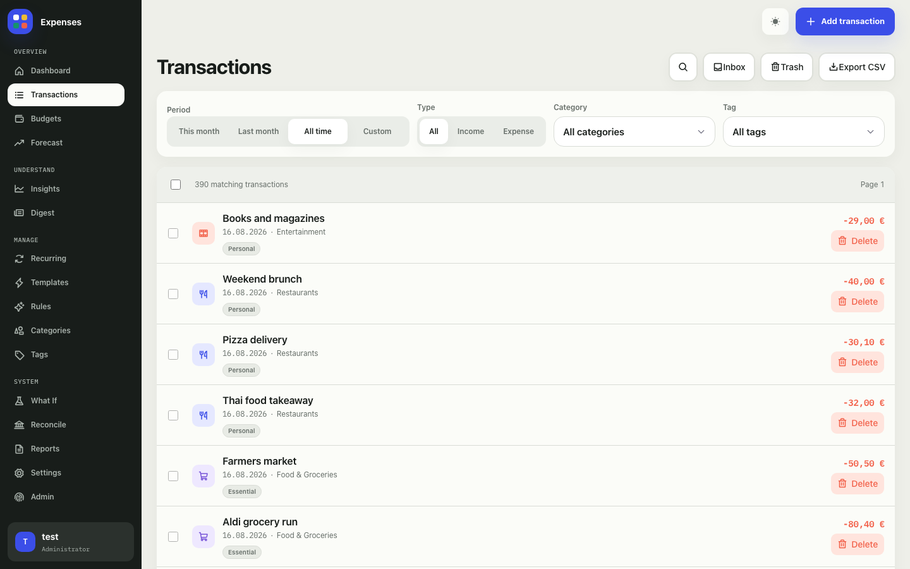
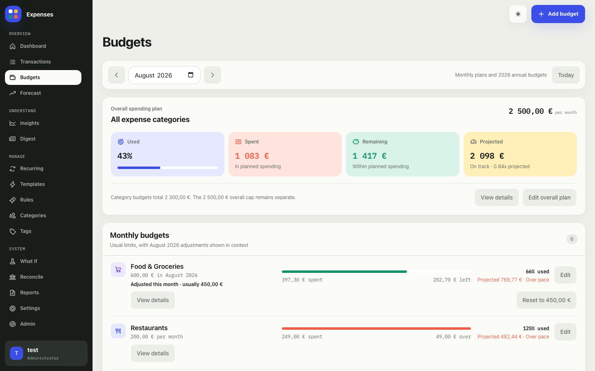
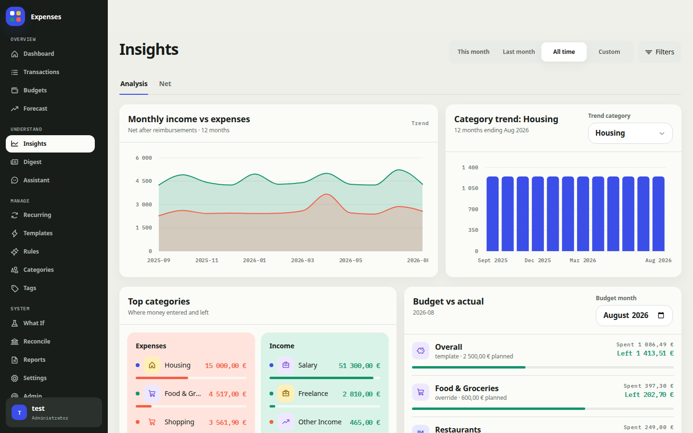
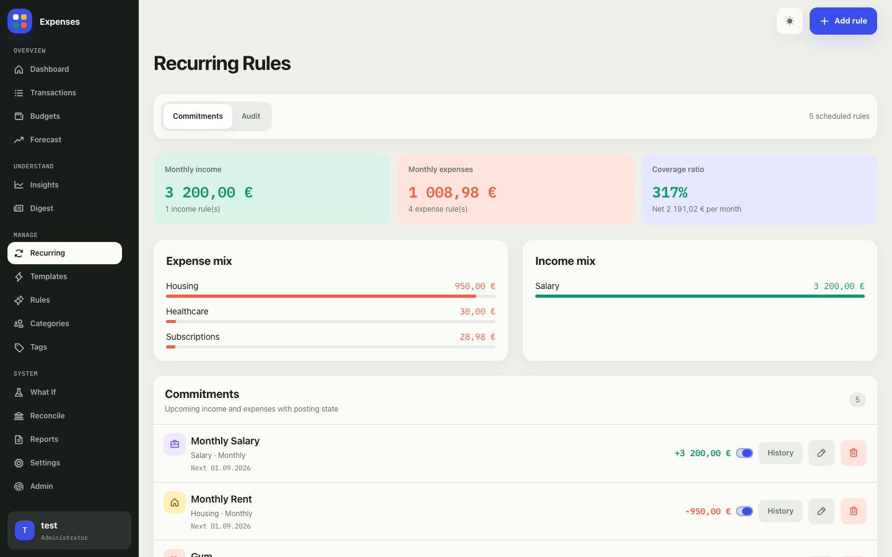
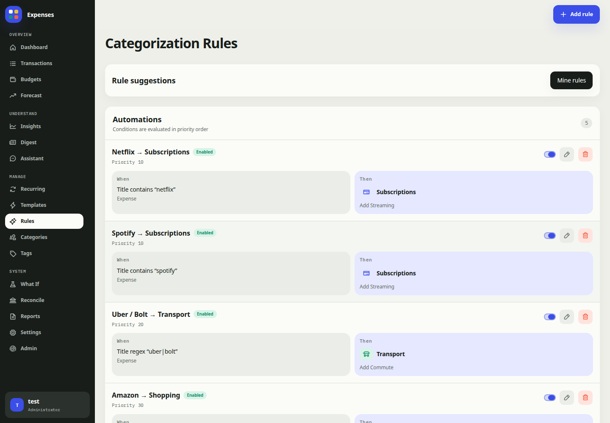
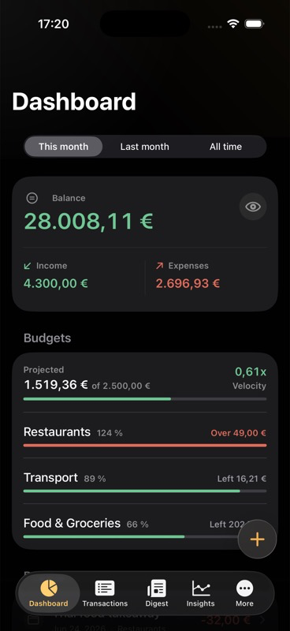
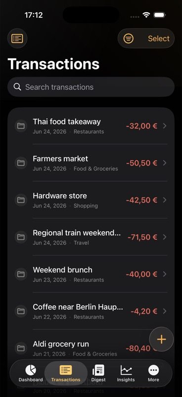
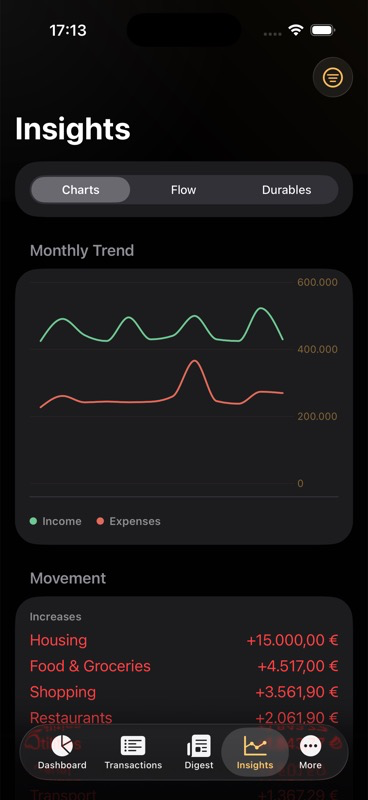
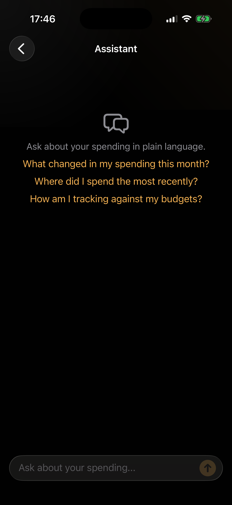

# Expenses

Private, self-hosted expense tracking for one person or a household. Expenses includes a web app, a native iOS app, and an ingest endpoint for logging a purchase as soon as you pay.

[](https://github.com/janishahn/expenses/actions/workflows/ci.yml)
[](LICENSE)
[](https://www.python.org/)



Expenses keeps transactions, budgets, receipts, reports, and bank reconciliation in one place. It stores data on hardware you control and runs well on modest hosts, including a Raspberry Pi 4B. SQLite is the default database, and money is stored as integer cents.

> **Project status:** This is my personal, source-available project. I maintain it as time allows and do not seek outside contributions, so I may not review issues or pull requests. You may fork it for your own noncommercial use under the [license](#license).

## Highlights

- A responsive web app and a native SwiftUI app use the same backend.
- Transactions support search, filters, tags, categories, receipts, locations, soft deletion, and CSV export.
- Monthly and annual budgets sit alongside recurring income and expenses, forecasts, and what-if plans.
- Dashboards, insights, digests, and PDF reports help explain where money went without hiding exact values.
- Bank reconciliation imports Commerzbank transaction CSV files and keeps unresolved rows in one review queue.
- Each user has separate data, so one private instance can serve a household.
- A token-protected endpoint can record purchases from Apple Shortcuts or another automation.
- Optional LLM tools can help with categorization and answer read-only questions about spending. They are off by default.

## A quick tour

### Dashboard

Start here for a quick answer to “where do I stand?” Choose a period to see your available balance, income, spending, net movement, and budget pace together. Recent transactions and spending charts then give you a useful next place to look without turning the page into a report.

### Transactions



Transactions is the full ledger. Add purchases and income here, or search and filter what you already recorded. Categories and tags keep the list useful over time; receipts, locations, notes, and soft deletion add detail without making every entry harder to create.

### Budgets



Use Budgets when you want to plan, not only review. Set monthly or annual limits, move between periods, and compare what you planned with what you spent. A one-month adjustment can handle an unusual month without changing the rest of the plan.

### Insights



Insights helps when totals alone do not tell the full story. Change the period or narrow the view by type and tags, then compare income with spending, inspect category trends, or open the Net view to see how each month changed the balance. Charts link back to the transactions behind them.

### Recurring income and expenses



Add salary, rent, subscriptions, and other regular payments once. Expenses can post them when they fall due and keeps an audit trail of what it created. These rules also make forecasts more useful because fixed payments stay separate from estimates based on past spending.

### Categorization rules



Rules take care of repeated sorting. Match a title, amount, or transaction type, then apply a category and tags to new or existing entries. If you enable LLM help, Expenses can suggest rules from your history; you still review them before they take effect.

### More tools

- **Forecast and What If** project cash flow and let you test a change before it becomes real.
- **Digest and Reports** turn recent activity into a short review or an exportable PDF.
- **Reconcile** compares a Commerzbank transaction CSV with your ledger and guides you through unresolved rows.
- **Assistant** answers read-only questions about your spending when optional LLM support is enabled.
- **Templates, categories, and tags** make frequent entries quick to create and old entries easier to find. Tags can be archived without losing historical assignments and hidden from filter menus independently.

## Run with Docker

Docker is the shortest path to a working install. It builds the web app, runs database migrations on startup, and keeps the database, receipts, logs, and generated secrets in a named volume.

```bash
git clone https://github.com/janishahn/expenses.git
cd expenses
docker compose up --build -d
```

Open `http://localhost:8000`. On first launch, Expenses asks you to create the admin account.

```bash
docker compose logs -f expenses
docker compose ps
docker compose down
```

You can set common options in a repo-root `.env` file:

```env
EXPENSES_HTTP_PORT=8000
EXPENSES_ENV=Production
EXPENSES_TIMEZONE=Europe/Berlin
EXPENSES_AUTH_SIGNUP_ENABLED=false
```

## Run on bare metal

You need Python 3.12+, Node.js 20+, npm, SQLite, and [uv](https://docs.astral.sh/uv/).

```bash
git clone https://github.com/janishahn/expenses.git
cd expenses
uv sync --frozen --no-dev
npm ci --prefix ui
npm run --prefix ui build
uv run --no-dev migrations
uv run --no-dev uvicorn expenses.app:app --host 0.0.0.0 --port 8000 --proxy-headers --forwarded-allow-ips 127.0.0.1
```

The repo also includes [`start.sh`](start.sh) as a small service entry point. Set `EXPENSES_DATA_DIR` to a persistent directory when you run it as a service. PDF export uses WeasyPrint and may need the system Cairo and Pango libraries.

## Configuration

Use [`.env.example`](.env.example) as a starting point. These are the main settings for a normal install:

| Setting | Purpose | Default |
|---|---|---|
| `EXPENSES_DATA_DIR` | Stores the SQLite database, imports, and generated secrets. | `./data` (`/data` in Docker) |
| `EXPENSES_DATABASE_URL` | Selects the database. SQLite is the intended self-hosted option. | `sqlite:///<data directory>/expenses.db` |
| `EXPENSES_RECEIPTS_DIR` | Stores uploaded receipt files. | `<data directory>/receipts` |
| `EXPENSES_LOG_DIR` | Stores structured application logs. | `logs/` beside the data directory (`/data/logs` in Docker) |
| `EXPENSES_TIMEZONE` | Sets the timezone for recurring transactions and date defaults. | `Europe/Berlin` |
| `EXPENSES_AUTH_SETUP_TOKEN` | Optionally protects first-time setup with an `X-Setup-Token` header. | unset |
| `EXPENSES_AUTH_SIGNUP_ENABLED` | Allows users to create accounts after the first admin exists. | `true` |
| `EXPENSES_FORWARDED_ALLOW_IPS` | Lists the direct proxy addresses that Uvicorn may trust for forwarded headers. | `127.0.0.1` |
| `EXPENSES_TRUSTED_PROXY_IPS` | Lists direct proxy addresses whose `X-Forwarded-Proto` value the app may trust. | unset |

### Optional LLM assistance

LLM features are off by default. To enable categorization help and the read-only spending assistant, configure an OpenAI-compatible endpoint that you trust with your financial data:

```env
EXPENSES_LLM_ENABLED=true
EXPENSES_LLM_BASE_URL=https://provider.example/v1
EXPENSES_LLM_MODEL=your-model
EXPENSES_LLM_API_KEY=your-api-key
```

Leave the API key blank only when a private endpoint intentionally accepts requests without one. Optional temperature and output-token settings are listed in [`.env.example`](.env.example).

## Serving & Access

Expenses serves the web app and API over plain HTTP on one port. Keep that port on localhost or a private network, and put HTTPS in front of it before remote use.

The simplest private setup uses [Tailscale](https://tailscale.com/):

```bash
tailscale serve --bg 8000
tailscale serve status
```

Use the resulting `https://<host>.<tailnet>.ts.net` address in the browser, the iOS app, and ingest automations. If you use a public reverse proxy or tunnel, remember that the same origin also exposes the mobile and ingest APIs. Read [`SECURITY.md`](SECURITY.md) before exposing an instance outside a private network.

## Data and backups

Back up the Docker `expenses_data` volume or the directory set by `EXPENSES_DATA_DIR`. A useful backup includes:

- `expenses.db`, including its `-wal` and `-shm` files while the app runs
- `receipts/`
- `secrets/csrf_secret`, unless you set the secret elsewhere

Treat the database, receipts, logs, generated secrets, and backups as private financial data.

## Development

Install the dependencies and start the backend and Vite development server:

```bash
uv sync --group dev
npm ci --prefix ui
uv run dev
```

Create the sample database with `uv run mock-db`. It adds a local demo user with the username and password `test`.

For a private preview on your current Tailscale network, run `uv run dev --tailnet`. Add `--detach` to keep it running after the terminal closes, then stop it with `uv run dev --tailnet --stop`.

The main checks are:

```bash
uv run fast-tests
uv run full-tests
```

`fast-tests` is the normal local gate. See [`TESTING.md`](TESTING.md) for focused browser commands and when to use the full suite. See [`releasing.md`](releasing.md) for the release process.

## Automatic ingest

Each user can create an ingest token in **Settings → Ingest Token**. The token is shown once, so copy it when you create it. You can rotate or revoke it from the same screen.

Send the token as a bearer token to `POST /api/ingest`:

```bash
curl -X POST https://<host>.<tailnet>.ts.net/api/ingest \
  -H "Authorization: Bearer <ingest-token>" \
  -H "Content-Type: application/json" \
  -d '{"amount_cents": 990, "title": "Bakery", "category": "Groceries"}'
```

The endpoint creates expenses. It requires `amount_cents` and `title`, and also accepts `date`, `category`, `latitude`, and `longitude`.

### Apple Wallet shortcut

You can record a card payment without opening Expenses:

1. In Shortcuts, create a **Personal Automation → Transaction**, choose the cards to watch, and select **Run Immediately**.
2. Calculate `Amount × 100`, then round it to the nearest integer. This converts euros to cents.
3. Add **Get Contents of URL**. Send a `POST` request to `https://<host>.<tailnet>.ts.net/api/ingest` with the header `Authorization: Bearer <ingest-token>` and a JSON body containing the calculated `amount_cents` and a `title`. Use the Wallet merchant when available, or a short fixed title.
4. Add `category` if useful, or add `latitude` and `longitude` together to store the location. You can also add **Show Notification** to display the response after each payment.

## Native iOS app

The SwiftUI client lives in [`ios/ExpensesApp`](ios/ExpensesApp) and targets iOS 26+. Open `ios/ExpensesApp/ExpensesApp.xcodeproj` in Xcode, or build, install, and launch it on the only paired iPhone with:

```bash
uv run run-ios-device
```

Set its backend URL to your Expenses HTTPS address. Mobile sessions stay in Keychain, and the app supports Face ID, Touch ID, or device-passcode unlock.

<p>
  
  
  
  
</p>

## License

Expenses uses the [PolyForm Noncommercial License 1.0.0](LICENSE). You may use, copy, change, and share it for permitted noncommercial purposes. The license does not allow commercial use, so this project is source-available rather than open source.
